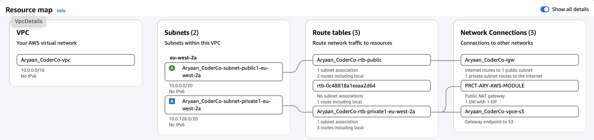
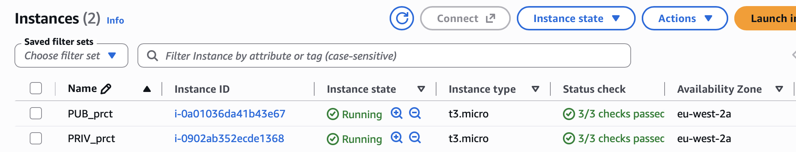
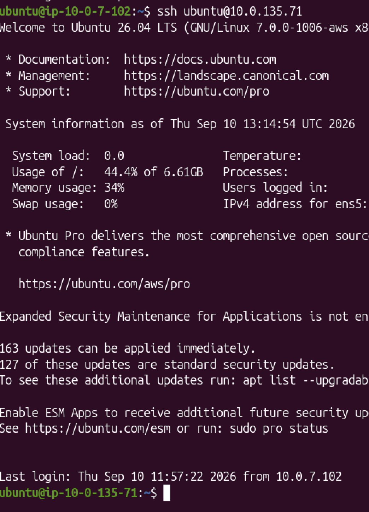

# Objective

Create a custom VPC with one public and one
private subnet, configure internet access and
routing, deploy EC2 instances, secure access
between them and enable monitoring.

# Assignment 1

## **Task 1 - Create the VPC and Subnets**

I created a custom VPC to provide an isolated
network where I could control the IP ranges,
routing and security.

I then created two subnets inside the VPC:

- One public subnet
- One private subnet

The public subnet was used for resources that
needed direct internet connectivity.

The private subnet was used for resources that
should not be directly accessible from the
internet.

### Steps

1. Created a custom VPC.
2. Assigned the VPC the CIDR range `10.0.0.0/16`.
3. Created a public subnet.
4. Created a private subnet.
5. Associated both subnets with the VPC.

### Screenshot

---

## **Task 2 - Configure Internet Access**

I created an Internet Gateway and attached it
to the VPC.

The Internet Gateway allows resources in the
public subnet to communicate with the internet
when the correct routing and public IP are
configured.

I also created a NAT Gateway inside the public
subnet.

The NAT Gateway allows resources inside the
private subnet to initiate connections to the
internet without making those resources
directly accessible from the internet.

An Elastic IP was assigned to the NAT Gateway
to give it a public IPv4 address.

### Steps

1. Created an Internet Gateway.
2. Attached the Internet Gateway to the VPC.
3. Created an Elastic IP.
4. Created a NAT Gateway in the public subnet.
5. Assigned the Elastic IP to the NAT Gateway.

The private internet traffic follows this path:

`Private EC2 -> NAT Gateway -> Internet Gateway -> Internet`

---

## **Task 3 - Configure Route Tables**

I configured separate route tables for the
public and private subnets.

The public route table sends internet-bound
traffic directly to the Internet Gateway.

The private route table sends internet-bound
traffic to the NAT Gateway.

### Public Route Table

I added:

`0.0.0.0/0 -> Internet Gateway`

This means traffic going to an IPv4 destination
that does not have a more specific route is sent
through the Internet Gateway.

### Private Route Table

I added:

`0.0.0.0/0 -> NAT Gateway`

This allows resources in the private subnet to
access the internet through the NAT Gateway.

I also had the local VPC route and my S3 VPC
endpoint route.

### Steps

1. Created/configured the public route table.
2. Associated it with the public subnet.
3. Added the default route to the Internet
   Gateway.
4. Created/configured the private route table.
5. Associated it with the private subnet.
6. Added the default route to the NAT Gateway.

### Screenshots

---

## **Task 4 - Deploy EC2 Instances**

I launched two Ubuntu EC2 instances.

The first instance was placed inside the public
subnet and was given a public IPv4 address.

The second instance was placed inside the
private subnet and did not have a public IPv4
address.

This created a public-facing instance and a
private instance that could not be accessed
directly from the internet.

### Steps

1. Launched the public EC2 instance.
2. Placed it inside the public subnet.
3. Enabled a public IPv4 address.
4. Launched the private EC2 instance.
5. Placed it inside the private subnet.
6. Kept the private instance inaccessible
   directly from the internet.

### Screenshot

---

## **Task 5 - Configure Security Groups**

I configured Security Groups to control which
traffic could reach each EC2 instance.

For the public EC2 instance, I allowed:

- SSH on port 22 from my own public IP.
- HTTP on port 80 from my own public IP.

For the private EC2 instance, SSH access was
allowed from the Security Group attached to the
public EC2 instance.

This meant the private instance could not be
accessed directly from the internet.

I have not included a Security Group screenshot
because it contains my personal public IP
address.

---

## **Bonus Task - Bastion Host**

I used the public EC2 instance as a Bastion Host.

A Bastion Host acts as a secure jump point for
accessing resources inside a private subnet.

Instead of connecting directly to the private
EC2 instance, I first connected to the public
EC2 instance.

From there, I connected to the private instance
using its private IP address.

The connection path was:

`My computer -> Public EC2 -> Private EC2`

I used SSH agent forwarding so that I did not
need to copy the private EC2 key onto the public
instance.

### Steps

1. Loaded the private EC2 key into my local SSH
   agent.
2. Connected to the public EC2 using SSH agent
   forwarding.
3. From the public EC2, connected to the private
   EC2 using its private IP.
4. Confirmed that I successfully reached the
   private instance.

### Screenshot

---

## **Bonus Task - CloudWatch Monitoring**

I enabled CloudWatch monitoring for both EC2
instances.

CloudWatch allows me to monitor the performance
and health of AWS resources using metrics.

I also configured the SSM Agent and CloudWatch
Agent on both instances.

The EC2 instances were given an IAM role so the
agents had permission to communicate with AWS
services.

The CloudWatch Agent can collect additional
operating system metrics such as memory usage.

CloudWatch can also be configured with alarms.

For example, an alarm could detect high CPU
usage and trigger another AWS action such as an
Auto Scaling policy.

CloudWatch itself does not automatically fix
every issue. It monitors resources and can
trigger configured actions when certain
conditions are met.

### Steps

1. Created an IAM role for the EC2 instances.
2. Attached the role to both EC2 instances.
3. Confirmed the SSM Agent was running.
4. Connected both instances to Systems Manager.
5. Installed and configured the CloudWatch
   Agent.
6. Deployed the CloudWatch configuration to
   both instances.
7. Confirmed both CloudWatch Agents were
   installed successfully.

### Screenshot

---

# Final Architecture

The final setup contains:

- Custom VPC
- Public subnet
- Private subnet
- Internet Gateway
- NAT Gateway
- Elastic IP
- Public route table
- Private route table
- Public EC2 instance
- Private EC2 instance
- Bastion Host access
- Security Groups
- S3 VPC Endpoint
- SSM Agent
- CloudWatch Agent

The public EC2 instance can communicate with
the internet through the Internet Gateway.

The private EC2 instance can access the internet
outbound through the NAT Gateway while remaining
inaccessible directly from the internet.

The public EC2 also acts as a Bastion Host for
secure access to the private instance.

CloudWatch is used to monitor both EC2
instances.