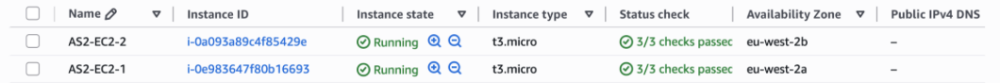
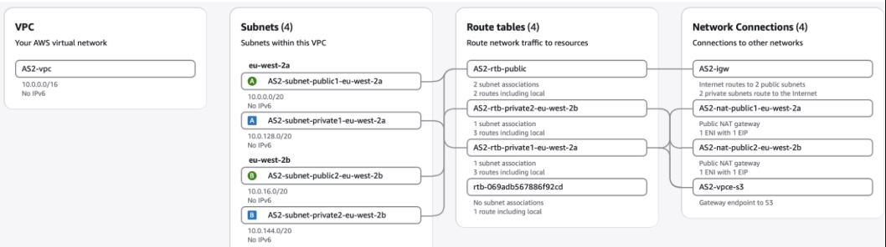
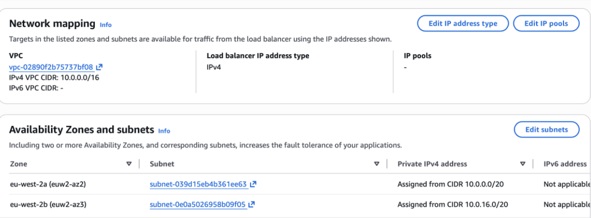
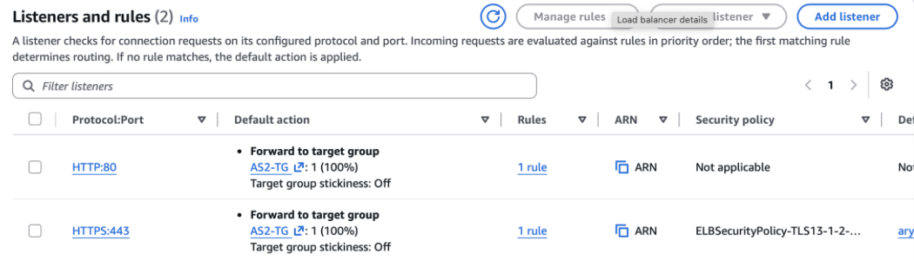
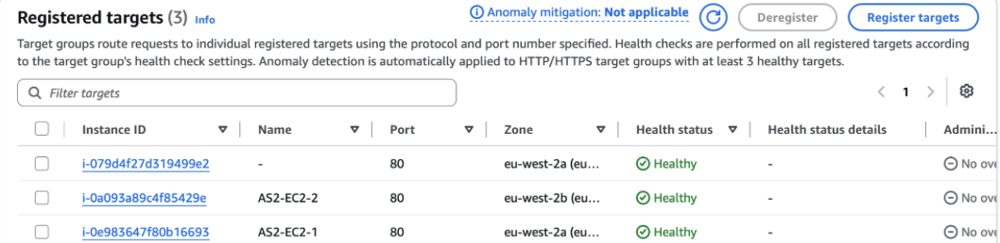
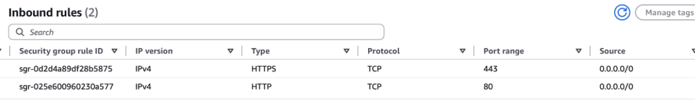
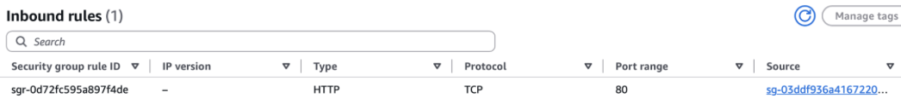
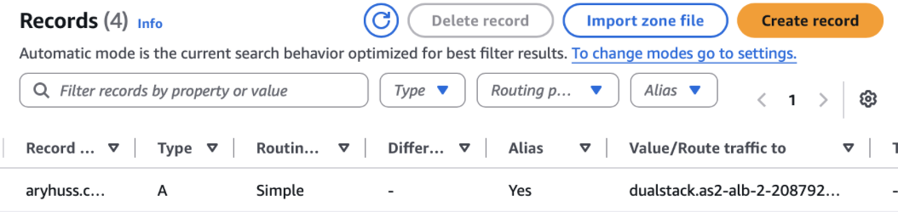
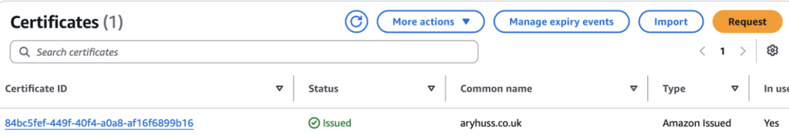
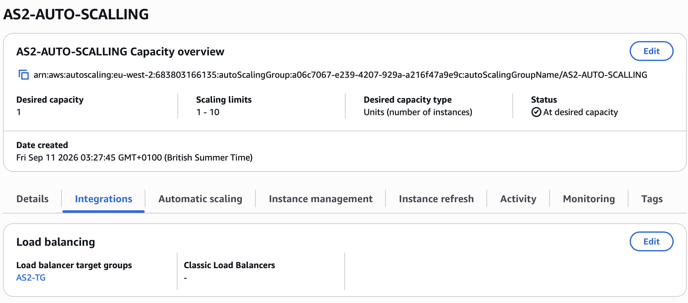

# Objective

Deploy two EC2 instances behind an Application Load Balancer (ALB), with the ALB handling incoming traffic and the EC2 instances protected from direct internet access.

The setup uses multiple Availability Zones, health checks and security group isolation. I also completed the bonus tasks by configuring Route 53, HTTPS with AWS Certificate Manager (ACM), and an Auto Scaling Group.

# Assignment 2 - Application Load Balancer

## Task 1 - Create the EC2 Instances

I deployed two EC2 instances inside the same VPC across different Availability Zones.

The instances were placed in private subnets so they would not be directly accessible from the internet.

- AS2-EC2-1 was deployed in eu-west-2a
- AS2-EC2-2 was deployed in eu-west-2b
- Neither instance was assigned a public IPv4 DNS address

This provides better availability because the application is not dependent on a single Availability Zone.

## Task 2 - Configure the VPC and Subnets

The VPC was configured across two Availability Zones with both public and private subnets.

The public subnets provide connectivity for internet-facing resources such as the Application Load Balancer, while the EC2 application servers are kept inside the private subnets.

The VPC also contains an Internet Gateway for the public subnets and NAT Gateways that allow resources in the private subnets to make outbound connections without allowing unsolicited inbound internet access.

## Task 3 - Create the Application Load Balancer

I created an internet-facing Application Load Balancer across two public subnets in different Availability Zones.

This allows users to access the application through the ALB rather than connecting directly to individual EC2 instances.

The ALB then forwards incoming requests to healthy instances within the target group.

## Task 4 - Configure ALB Listeners

I configured the Application Load Balancer with two listeners:

- HTTP on port 80
- HTTPS on port 443

Both listeners forward incoming requests to the AS2-TG target group.

The HTTP listener satisfies the main assignment requirement, while HTTPS was added as part of the bonus configuration.

## Task 5 - Configure the Target Group and Health Checks

I created the AS2-TG target group using HTTP on port 80.

The EC2 instances were registered as targets and the health check was configured against the root path `/`.

The ALB continuously performs health checks so that traffic is only forwarded to targets that are considered healthy.

Both original EC2 instances returned a healthy status. The screenshot also shows an additional healthy instance created through the Auto Scaling Group bonus configuration.

## Task 6 - Configure the ALB Security Group

The ALB security group allows incoming web traffic from the internet.

The inbound rules allow:

- HTTP port 80 from 0.0.0.0/0
- HTTPS port 443 from 0.0.0.0/0

This makes the Application Load Balancer the public entry point to the application.

## Task 7 - Protect the EC2 Instances

The EC2 security group was configured differently from the ALB security group.

Instead of allowing HTTP traffic from anywhere, port 80 only accepts traffic where the source is the ALB security group.

This means internet users cannot directly access the web servers. Requests must first reach the Application Load Balancer, which can then communicate with the EC2 instances.

This creates the following traffic flow:

User → ALB → EC2

## Task 8 - Test Load Balancing

To test the setup, each EC2 instance was configured to return different web content.

I accessed the application through the ALB and refreshed the page to confirm that requests were being distributed between the instances.

One request was served by Instance 1:

Another request was served by Instance 2:

This confirmed that the Application Load Balancer could successfully distribute requests across multiple healthy EC2 instances.

# Bonus Tasks

## Bonus 1 - Route 53 DNS

Instead of requiring users to access the application using the long AWS-generated ALB DNS name, I configured my domain using Amazon Route 53.

I created an A record using Alias routing and pointed `aryhuss.co.uk` to the Application Load Balancer.

The request flow therefore became:

aryhuss.co.uk → Route 53 → ALB → EC2

## Bonus 2 - HTTPS with AWS Certificate Manager

I requested an SSL/TLS certificate for `aryhuss.co.uk` using AWS Certificate Manager.

The certificate was validated through DNS and successfully reached the `Issued` state.

I then attached the certificate to the ALB HTTPS listener on port 443, allowing encrypted HTTPS connections to the application.

## Bonus 3 - Auto Scaling Group

I created an Auto Scaling Group and connected it to the existing AS2-TG target group.

A launch template defines how new EC2 instances should be created, including the AMI, instance type, key pair and security group.

The Auto Scaling Group was configured with:

- Desired capacity: 1
- Minimum capacity: 1
- Maximum capacity: 10
- Multiple Availability Zones
- AS2-TG load balancer target group integration

This allows AWS to manage the number of EC2 instances within the configured limits and register instances with the target group.

# Architecture

The final architecture follows this traffic flow:

Internet User
→ Route 53
→ Application Load Balancer
→ Target Group
→ EC2 Instances in Private Subnets

HTTPS traffic is secured using an ACM certificate, while the Auto Scaling Group provides the ability to manage application capacity.

The security groups ensure that users can communicate with the public ALB, but cannot directly access the EC2 application servers.

# What I Learned

This assignment helped me understand how AWS services work together to build a more secure and highly available application architecture.

I gained practical experience with:

- Deploying resources across multiple Availability Zones
- Public and private subnet architecture
- Application Load Balancers
- Target groups and health checks
- Security group to security group communication
- Isolating EC2 instances from direct internet access
- Route 53 Alias records
- SSL/TLS certificates using ACM
- HTTP and HTTPS listeners
- Auto Scaling Groups and launch templates
- Connecting Auto Scaling with an existing load balancer

The main concept I took from this assignment is that the EC2 instances do not need to be exposed directly to users. The ALB acts as the public entry point and distributes traffic to healthy application servers behind it.