# Objective

Host a static website using Amazon S3, deliver it
through CloudFront, connect a custom domain using
Route 53, enable HTTPS and add security headers.

# Assignment 3

## **Task 1 - Create S3 Bucket and Upload Website**

I created an Amazon S3 bucket to store the files
for my static website.

I uploaded two HTML files:

- `index.html`
- `error.html`

The `index.html` file contained the main website
content.

The `error.html` file was used as the error page
for the static website.

1. Created an S3 bucket.
2. Uploaded `index.html`.
3. Uploaded `error.html`.
4. Confirmed both files were stored in the bucket.

### Screenshot

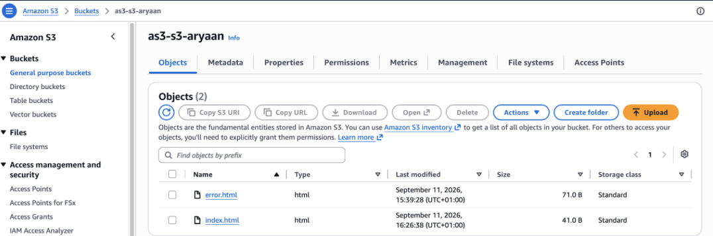

---

## **Task 2 - Enable S3 Static Website Hosting**

I enabled static website hosting on the S3
bucket.

This allowed the S3 bucket to host the HTML
files as a website and provided an S3 website
endpoint.

The S3 website endpoint was then used as the
origin for CloudFront.

1. Opened the S3 bucket properties.
2. Enabled static website hosting.
3. Configured the bucket for website hosting.
4. Confirmed the S3 website endpoint was created.

### Screenshot

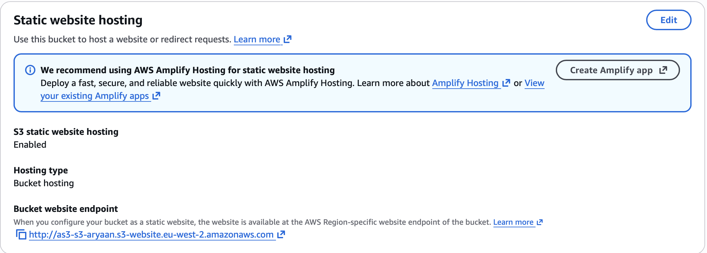

---

## **Task 3 - Create CloudFront Distribution**

I created an Amazon CloudFront distribution to
deliver the website.

CloudFront uses AWS edge locations to cache and
deliver content closer to users.

I also added my custom domain:

`aryhuss.co.uk`

to the CloudFront distribution.

1. Created a CloudFront distribution.
2. Added the S3 website as the origin.
3. Added `aryhuss.co.uk` as the alternate domain
   name.
4. Configured the distribution to use HTTPS.

### Screenshot

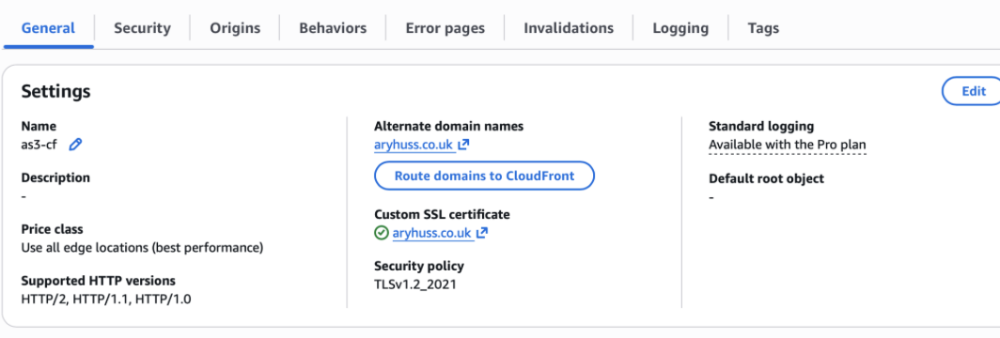

---

## **Task 4 - Configure CloudFront Origin**

I configured my S3 static website endpoint as
the origin for the CloudFront distribution.

The origin is where CloudFront retrieves the
original website files when they are not already
available in the CloudFront cache.

The request path is:

`User -> CloudFront -> S3 Origin`

### Screenshot

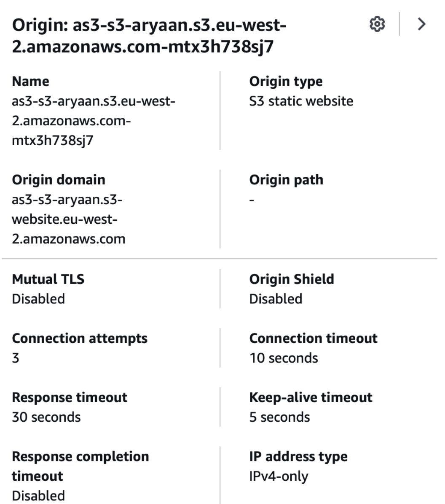

---

## **Task 5 - Configure CloudFront Cache Behaviour**

I configured the default cache behaviour for
the CloudFront distribution.

I enabled automatic compression and configured
CloudFront to redirect HTTP requests to HTTPS.

The allowed HTTP methods were:

- GET
- HEAD

I also used the AWS managed
`CachingOptimized` cache policy.

1. Configured the default `*` path behaviour.
2. Enabled automatic compression.
3. Selected Redirect HTTP to HTTPS.
4. Allowed GET and HEAD requests.
5. Used the `Managed-CachingOptimized` policy.

### Screenshot

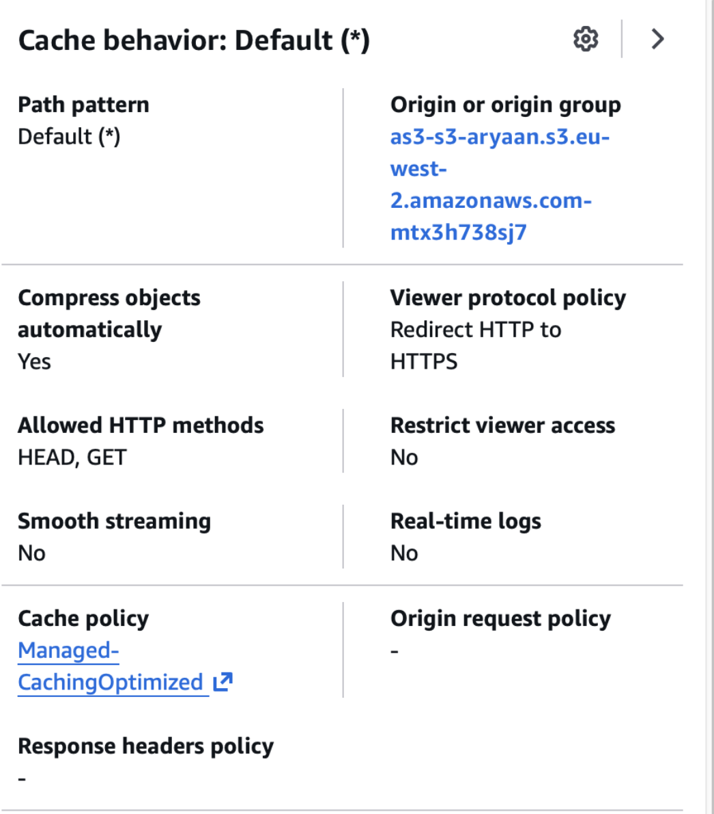

---

## **Task 6 - Configure SSL Certificate**

I used AWS Certificate Manager to create an
SSL/TLS certificate for:

`aryhuss.co.uk`

The certificate used by CloudFront was created
in the `us-east-1` region.

The certificate was successfully issued and
used by the CloudFront distribution.

This allowed the website to use HTTPS instead
of only HTTP.

1. Requested an SSL/TLS certificate.
2. Added `aryhuss.co.uk` to the certificate.
3. Validated the domain.
4. Confirmed the certificate status was Issued.
5. Added the certificate to CloudFront.

### Screenshot

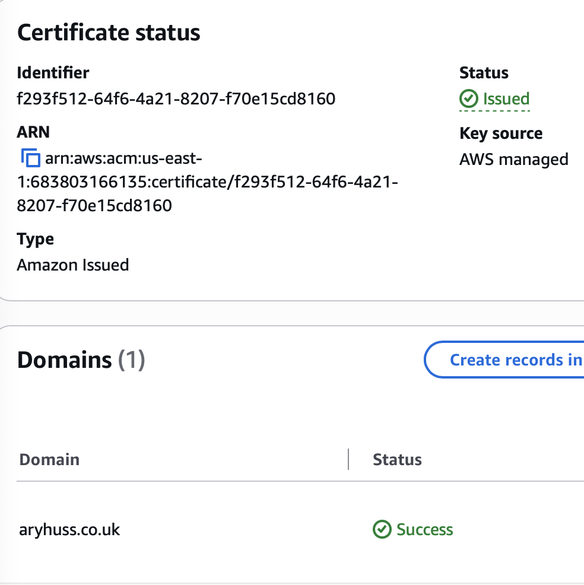

---

## **Task 7 - Configure Route 53**

I configured Route 53 so that my custom domain
pointed to the CloudFront distribution.

I created an Alias A record for:

`aryhuss.co.uk`

The Alias record pointed to the CloudFront
distribution rather than directly to the S3
bucket.

The request path became:

`aryhuss.co.uk -> Route 53 -> CloudFront -> S3`

1. Opened the Route 53 hosted zone.
2. Created an A record.
3. Enabled Alias.
4. Selected Alias to CloudFront distribution.
5. Selected my CloudFront distribution.
6. Saved the record.

### Screenshot

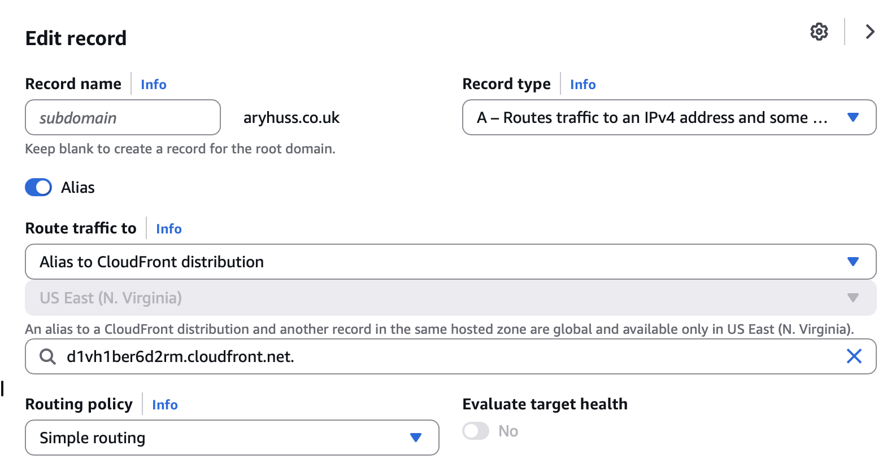

---

## **Task 8 - CloudFront Cache Invalidation**

After changing the website files, I created a
CloudFront invalidation.

I used:

`/*`

This invalidated the cached website content so
CloudFront could retrieve the updated files from
the S3 origin.

1. Opened the CloudFront distribution.
2. Opened the Invalidations section.
3. Created a new invalidation.
4. Entered `/*`.
5. Confirmed the invalidation completed.

### Screenshot

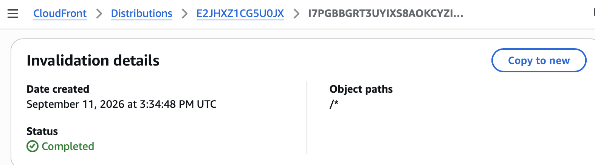

---

## **Bonus Task - CloudFront Security Headers**

I created a CloudFront Function to add security
headers to responses from the website.

The function added:

- `X-Frame-Options: DENY`
- `X-Content-Type-Options: nosniff`

`X-Frame-Options: DENY` prevents the website
from being displayed inside a frame.

`X-Content-Type-Options: nosniff` tells the
browser not to guess a different content type
from the one provided.

### Screenshot

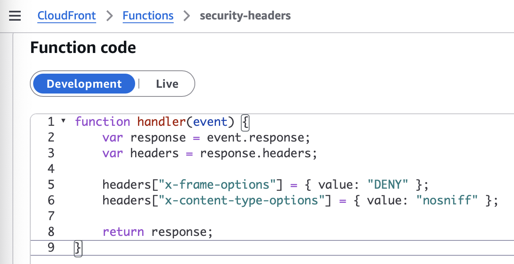

---

## **Bonus Task - Associate Security Function**

I associated the CloudFront Function with the
Viewer Response event.

This means the function runs when CloudFront is
about to return a response to the user.

The security headers are added to the response
before it reaches the browser.

1. Created the CloudFront Function.
2. Added the security header code.
3. Published the function.
4. Opened the CloudFront cache behaviour.
5. Associated the function with Viewer Response.
6. Saved the CloudFront configuration.

### Screenshot

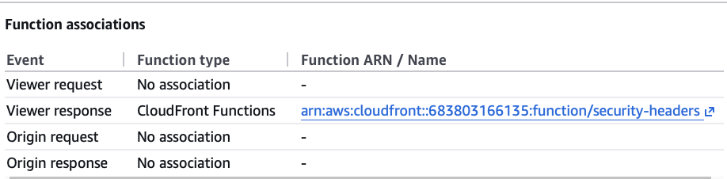

---

## **Task 9 - Test the Live Website**

I accessed the website using my custom domain:

`aryhuss.co.uk`

The website successfully loaded through
CloudFront using HTTPS.

This confirmed that Route 53, CloudFront, the
SSL certificate and the S3 origin were working
together correctly.

### Screenshot

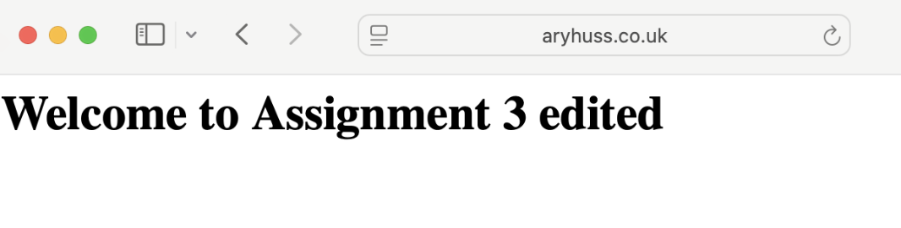

---

## **Task 10 - Test Security Headers**

I used `curl` to inspect the HTTP response
headers returned by the website.

I ran:

`curl -I https://aryhuss.co.uk`

The response returned:

- `HTTP/2 200`
- `x-content-type-options: nosniff`
- `x-frame-options: DENY`
- `x-cache: Hit from cloudfront`

This confirmed that the website was being
delivered successfully through CloudFront and
that the CloudFront Function was adding the
security headers.

### Screenshot

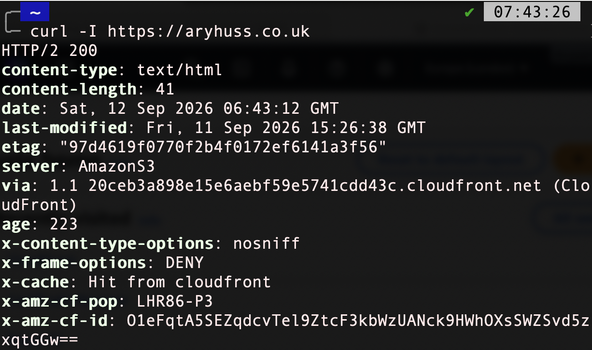

---

# Final Architecture

The final setup contained:

- Amazon S3 bucket
- `index.html`
- `error.html`
- S3 static website hosting
- CloudFront distribution
- S3 website origin
- CloudFront caching
- CloudFront cache invalidation
- Route 53
- Custom domain
- AWS Certificate Manager certificate
- HTTPS
- CloudFront Function
- Security headers

The website request followed this path:

`User -> Route 53 -> CloudFront -> S3`

Route 53 directed `aryhuss.co.uk` to the
CloudFront distribution.

CloudFront delivered cached content from AWS
edge locations or retrieved the website files
from the S3 origin when required.

HTTPS was enabled using an SSL/TLS certificate
from AWS Certificate Manager.

A CloudFront Function was associated with the
Viewer Response event to add additional security
headers before the response was returned to the
user.

The AWS resources used for the assignment were
taken down after completing and documenting the
project to avoid unnecessary charges.